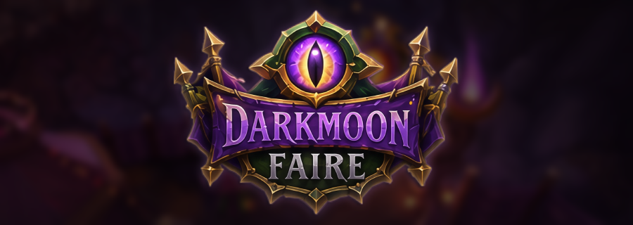
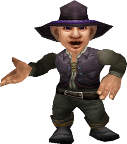

<div align="center">



<br/>
<br/>

### *"Step right up, step right up..."*
### *"Welcome to the greatest show on Azeroth."*

**A 1:1 rebuild of the Darkmoon Faire for World of Warcraft 3.3.5a.**
**Open-source. TrinityCore-first. AzerothCore to follow.**

<br/>

[](#)
[](LICENSE)
[](https://www.trinitycore.org/)
[](https://www.azerothcore.org/)

</div>

<br/>

<div align="center">
  
</div>

<br/>

<table>
<tr>
<td width="180" align="center" valign="top">
  
  <br/>
  <sub><i>Silas Darkmoon</i></sub>
</td>
<td valign="top">

> *"Amaze at the wonders that the Darkmoon Faire has uncovered in this vast and mysterious world!*
> *We have spared no expense in bringing you excitement that children of all ages will delight in!*
> *We have it all... delicious food, strong drink, exotic artifacts, fortunes read, amazing prizes — and excitement without end!"*

The Faire was never meant to stop in Wrath. **This project brings it back** — the tents, the games, the prize tickets, the cards, the mysterious gnome and his wandering family of freaks — exactly as it should be, on the 3.3.5a client.

</td>
</tr>
</table>

<br/>

## ✦ Step Right Up

> *Ahead of you, down the path...*
> *A majestic, magical Faire!*
> *Ignore the darkened, eerie woods —*
> *Ignore the eyes that blink and stare.*

This is a side-project. A love letter. A faithful, hand-built rebuild of the Darkmoon Faire — its layout, its NPCs, its quests, its mini-games, its prize economy — all reconstructed for **Wrath of the Lich King (3.3.5a)** emulation.

No reskins. No "WotLK-flavored" approximation. The real Faire.

<br/>

<div align="center">
  
</div>

<br/>

## ✦ The Show So Far

*What has already been raised on the fairgrounds:*

| | Component | Status |
|:---:|:---|:---:|
| 🌙 | **Map, areas, lights** | ✅ Done |
| 🎵 | **Ambient music & soundscapes** | ✅ Done |
| 🎪 | **NPC spawns** | 🟡 ~90% |
| 📜 | **Quests** (writing + scripting) | 🟠 In progress |
| 🎲 | **Mini-games & barker logic** | 🟠 In progress |
| 🎟️ | **Prize ticket economy** | 🟠 In progress |
| 🃏 | **Darkmoon Card turn-ins** | 🟠 In progress |
| 🐉 | **Backported models** | 🔴 Help wanted |
| ✨ | **Spell visuals & animations** | 🔴 Help wanted |

<br/>

## ✦ The Faire Seeks...

> *"From the four corners of Azeroth, and beyond!"*

The Faire is hiring its caravan. **Not a team. Not a commitment. Just curious hands.** If one of these calls to you, step forward:

### 🎭 Model Backporter
Pulling **mounts, creatures, and items** from later expansions and adapting them to the 3.3.5a client. The goal is **1:1 with the modern Faire** — so anything Blizzard added past Wrath needs to come home to Wrath.

### ✨ Spell & Animation Artist
The mini-games need their visuals. **Spell effects, animations, projectiles** — nothing exotic, mostly straightforward work, but done with care. If you know your way around `SpellVisualKit.dbc` and `M2` animation IDs, you'll be at home here.

**Everything else** — quests, scripts, mini-game logic, UI, gameobjects, server-side glue — I'm handling solo. The above are the two areas where I'd rather not burn three months climbing the learning curve when someone who already lives in those tools could do it in an afternoon.

<br/>

<div align="center">
  
</div>

<br/>

## ✦ Behind the Curtain

> *"The Faire is a business — don't be fooled by the surprisingly few goblins involved."*

### Stack

- **Core:** TrinityCore (3.3.5a) — AzerothCore port to follow
- **Client patch:** custom MPQ (models, DBCs, BLPs)
- **Scripts:** C++ scriptloader + SQL data
- **Mini-games:** server-side logic + client-side spell visuals

### Build & Install

> *Coming soon — once the first playable slice is ready to test, the setup will be documented here.*

```bash
# 1. Patch your TrinityCore source
git apply patches/darkmoon-faire.patch

# 2. Import the SQL
mysql -u root -p world < sql/world/darkmoon_faire.sql

# 3. Drop the patch MPQ into your client
cp patches/patch-D.mpq /path/to/Wow/Data/

# 4. Travel to Darkmoon Island. Bring tickets.
```

<br/>

## ✦ Tour Schedule

> *"It spends most of its time in 'parts unknown,'*
> *but every month or so it stops..."*

| Phase | The Tent | Status |
|:---:|:---|:---:|
| **I** | Map, layout, NPC spawns, ambient | 🟢 Nearly complete |
| **II** | Quests, dialogues, prize ticket economy | 🟠 In progress |
| **III** | Mini-games — all of them | 🟠 In progress |
| **IV** | Backported models, spell visuals | 🔴 Waiting for caravan |
| **V** | Public TrinityCore release | ⚪ Planned |
| **VI** | AzerothCore port | ⚪ Planned |

No deadlines. No promises. The Faire arrives when the Faire arrives.

<br/>

## ✦ The Caravan

> *"The Darkmoon Faire is a family. A family that takes care of itself."*

- **Showrunner / Core dev** — [iThorgrim](https://github.com/iThorgrim)
- **Model backports** — *the seat is yours*
- **Spell visuals** — *the seat is yours*

Want to join the caravan? Open an issue, drop a PR, or reach out directly. No formal process — if you can help, you're already in.

<br/>

<div align="center">
  
</div>

<br/>

## ✦ License

Released under **GPL v3**, matching the upstream emulator licenses.
All Blizzard-owned assets remain the property of Blizzard Entertainment.
This project provides only the **code, data, and tooling** required to rebuild the Faire on a private 3.3.5a server using a legally-obtained client.

<br/>

<div align="center">

### *"We'll be at this location all week — be sure to tell your friends and loved ones."*

<sub>— Silas Darkmoon</sub>

<br/>

⭐ *If this project intrigues you, leave a star. The barkers appreciate it.*

</div>
